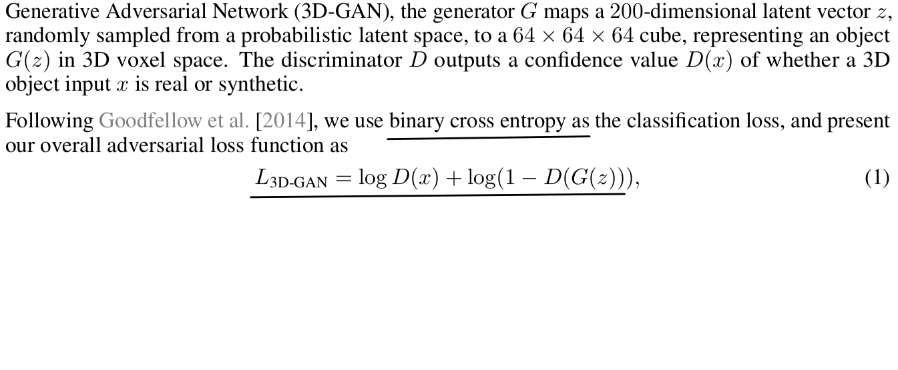

# Learning a Probabilistic Latent Space of Object Shapes via 3D Generative-Adversarial Modeling. NIPS 2017

[Access link](http://3dgan.csail.mit.edu/)

*Presented by Pooran Singh Negi*

**Summary:** Papers propose **3D- Generative Adversial Network(3D-GAN)**
for 3D object creation (using sample from a probablistic space) and
classification task. This latent space can also be inferred as shown in 2D image to 3D image generation( **3D-VAE-GAN section**). A VAE is used along with
3D-VAN for this setup. Proposed method shows state of the art and above
performance against supervised and unsupervied method. Another interesting
work done in paper is showing latent space arithmetics where objects can
be manipulated in latent space to build new novel and realistic objects.
This is simialr to word to vector of  Mikolov but is more impressive
as manipuation is done in latent space not the actual learned representation space.

- **Main architecture**

credit:: All the figure realted to this papers are from ppt and paper from
Jiajun Wu*, Chengkai Zhang*, Tianfan Xue, William T. Freeman, and Joshua B. Tenenbaum

Network: 

- Loss functions
  + 3D-GAN
  
  + 3D-VAE-GAN
  

